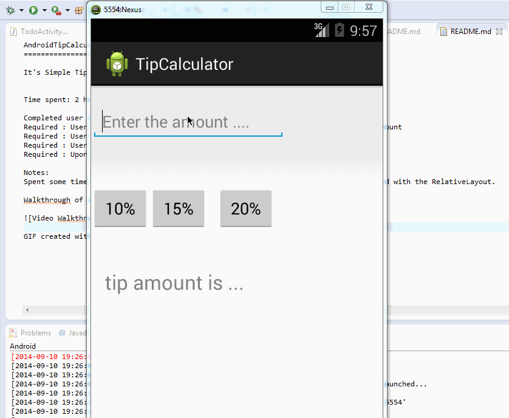

AndroidTipCalculator
====================

It's Simple Tip calculator App Developed in Android.

Time spent: 2 hours spent in total

Completed user stories:
Required : User is displayed the tip of specified percentage for specified entered amount
Required : User enters the total amount of the transaction
Required : User can select between tip amounts (i.e 10%, 15%, 20%)
Required : Upon selecting tip amount, formatted tip value is displayed
 
Notes:
Spent some time making the UI work across multiple phone resolutions by playing around with the RelativeLayout.

Walkthrough of all user stories:

GIF created with [LiceCap](http://www.cockos.com/licecap/).
